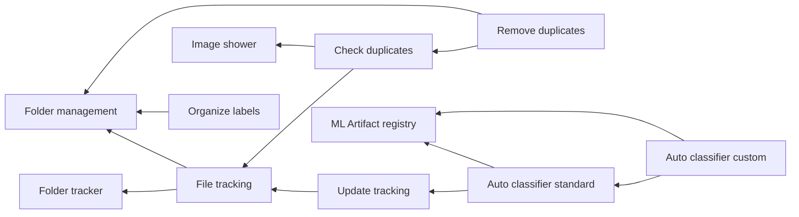

# Roadmap

Since this was a simple project I created when entering data science to help me with something specific, it is missing lots of stuff. Also, I spent 90% of the time messing around and having fun with adding noise to images and checking for duplicates while reflecting what it meant for two images to be "duplicates". My concept of fun is kinda weird. 

The main problems here were that:
- [x] The code structure leaves MUCH to be desired. (starting work on it).
- [x] Missing a requirements.txt file (added environment.yml).
- [x] The code doesn't follow any practices for object oriented programming development. Sorry Uncle Bob. (I'm trying.)
- [x] It doesn't have documentation. (may someone - me - might need it)
- [x] It doesn't have unit tests. (now it does)

Ok, it had barely anything. Maybe I can make it better today. Probably not, but what is keeping me from trying, right?

So, lets try. Also, always nice to save this code somewhere other than my computer folder hell (which, amazingly, got better).

## Features

After all that, some ideas for an actual roadmap.

- [x] \[**Folder tracker**\] Create file to know folder is being tracked by imgFolder
- [ ] \[**File tracking**\] Start tracking files from tracked folder
- [ ] \[**Update tracking**\] Update database to reflect changes in tracked filed (path changes)
- [ ] \[**Image shower**\] Show images when checking duplicates and giving labels.
- [ ] \[**Check duplicates**\] Check duplicated images (as in, duplicated content).
- [x] \[**Folder management**\] Enable management of folder (moving images, creating folders, ...)
- [ ] \[**Remove duplicates**\] Remove duplicated images.
- [ ] \[**Organize labels**\] Organize images in folder according to their labels (creating subfolders)
- [ ] \[**Auto classifier standard**\] Auto-classify images in labels according to standard group of labels.
- [ ] \[**Auto classifier custom**\] Auto-classify images in labels according to a custom group of labels.
- [ ] \[**ML Artifact registry**\] Manage ML artifacts (models).
- [x] \[**Docs**\] Roadmap.
- [x] \[**Docs**\] Modules/Layers diagram.
- [ ] \[**Docs**\] Classes diagram.
- [ ] \[**Docs**\] Sphinx documentation for classes and methods.

## Features dependencies

